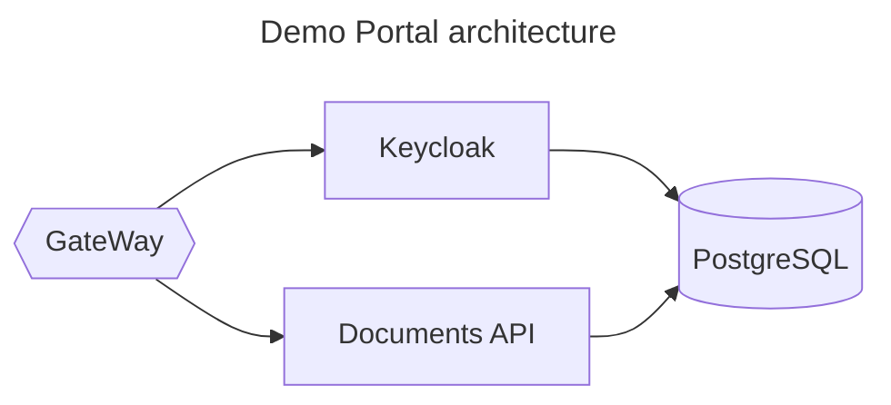

## Demo portal
Technologies:
* .NET 7
* PostgreSQL
* Keycloak
* Microservices architecture
* OpenId
* Docker




## Docker

To deploy, go to `docker` folder, then run a command:

```shell
docker compose up
```

## Authentication

1. Open the swagger page
http://localhost:5003/swagger/index.html

2. Click `Authorize`
3. Under `OAuth (OAuth2, authorizationCode with PKCE)` click `Authorize`
4. Ender credentials:
    * Username: demo
    * Password: demo
5. Try methods in swagger